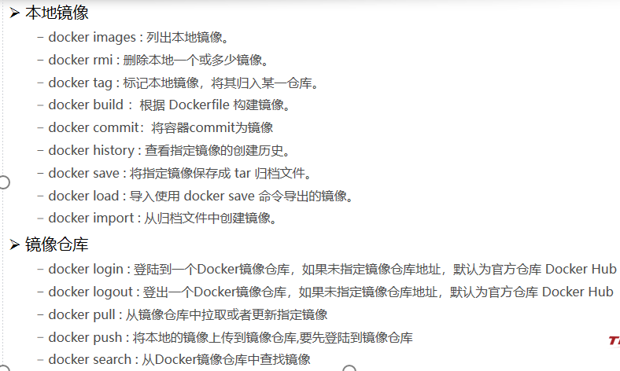
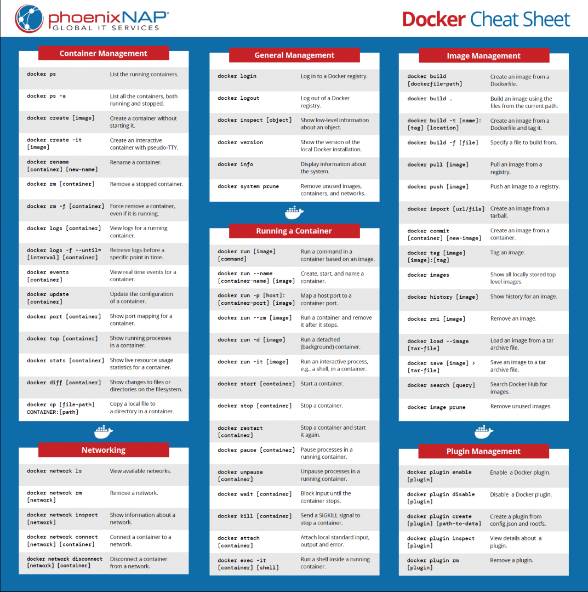

# 云原生
## 云计算简单概念
1. 为什么会使用云平台
   常见云平台：阿里云，腾讯云等
   我们的应用一般都是要放在云上，而非程序员自己的电脑上

2. 公有云
   公有云是最常见的云计算部署类型。公有云资源（例如服务器和存储空间）由第三方云服务提供商拥有和运营，这些资源通过Internet提供。在公有云中，所有硬件、软件和其他支持性基础结构均为云提供商所拥有和管理。Microsoft Azure是公有云的一个示例。
   在公有云中，你与其他组织或云“租户”共享相同的硬件、存储和网络设备，并且你可以使用Web浏览器访问服务和管理帐户。公有云部署通常用于提供基于Wb的电子邮件、网上办公应用、存储以及测试和开发环境。
   公有云优势：

* 成本更低：无需购买硬件或软件，仅对使用的服务付费。
* 无需维护：维护由服务提供商提供
* 近乎无限制的缩放性：提供按需资源，可满足业务需求。
* 高可靠性：具备众多服务器，确保免受故障影响。
  * 高可用性：N个9

3. 私有云
   私有云由专供一个企业或组织使用的云计算资源构成。私有云可在物理上位于组织的现场数据中心，也可由第三方服务提供商托管。但是，在私有云中，服务和基础结构始终在私有网络上进行维护，硬件和软件专供组织使用。
   这样，私有云可使组织更加方便地自定义资源，从而满足特定的T需求。私有云的使用对象通常为政府机构、金融机构以及其他具备业务关键性运营且希望对环境拥有更大控制权的中型到大型组织。
   私有云优势：

* 灵活性更强：组织可自定义云环境以满足特定业务需求。
* 控制力更强：资源不与其他组织共享，因此能获得更高的控制力以及更高的隐私级别。
* 可伸缩性更强：与本地基础结构相比，私有云通常具有更强的可伸缩性。

4. 混合云

## docker简介

1. docker基本概念

解决的问题：

* 统一标准
  * 应用构建
  * 应用分享
    * 所有的软件镜像放到一个指定的额地方 docker hub
    * 类似于安卓应用市场
  * 应用运行
    * 统一标准的镜像
    * docker run
* 虚拟化技术->容器化技术
  * 基础镜像只有MB级别
  * 创建简单
  * 隔离性强
  * 启动速度快

2. docker架构

3. 简单概括就是安装好**Docker**，然后去**软件市场**寻找**镜像**，下载并运行，查看**容器**状态日志等排错

## 容器的特点

1. 容器是自包含的
   1. 打包了应用程序及其所有依赖，可以直接运行
2. 容器是可移植的
   1. 可以在几乎任何地方以相同的方式运行
3. 容器是相互隔离的
   1. 同一节点上运行的多个容器，不会相互影响
4. 容器是轻量级的
   1. 容器秒级启动，且占用资源少

## docker基础概念

1. 宿主机（Host）
   1. docker所在的物理机，是容器运行的系统环境
2. 镜像（Image）
   1. 相当于一个程序模板，通过这个模板可以启动多个相似的容器
3. 容器（Container）
   1. 是docker运行的最小对象单元，是通过镜像实例化出来的一个运行中的对象
4. 仓库（Registry）
   1. 集中式的管理、存储镜像的仓库，可以管理多版本的镜像

* 关系：
  * 从**镜像仓库**中拉取到**容器镜像**，使用容器镜像在**宿主机**上运行**容器**。

## docker的常见命令

1. docker镜像管理

   1. 列出本地镜像：

      1. docker images \[OPTIONS][REPOSITORY[:TAG]]

   2. 拉取镜像到本地：

      1. docker pull [OPTIONS] NAME[:TAG|@DIGEST]

   3. 给镜像打tag：

      1. docker tag SOURCE_IMAGE[:TAG] TARGET_IMAGE[:TAG]

   4. 上传本地镜像：

      1. docker login [OPTIONS] [SERVER]    docker pull [OPTIONS] NAME[:TAG|@DIGEST]

   5. 删除本地镜像：

      1. docker rmi [OPTIONS] IMAGE [IMAGE...]

   6. 整合：

      

2. 容器管理：

   1. 见下

3. 整合：

   

## docker深入

1. docker方案

   1. Docker 镜像解决了打包这个根本性问题。所谓 Docker 镜像（不是Docker容器），其实就是一个压缩包。但是这个压缩包里的内容，却不止应用的可执行文件和启动脚本。大多数 Docker 镜像是直接由一个完整操作系统的所有文件和目录构成的，所以这个压缩包里的内容跟你本地开发和测试环境用的操作系统是完全一样的。
   2. Docker 这种打包机制直接打包了应用运行所需要的整个操作系统，所需要的所有依赖，从而保证了本地环境和云端环境的高度一致，避免了用户通过“试错”来匹配两种不同运行环境之间差异的痛苦过程。

2. docker架构

   1. 采用C/S架构

      1. Client 通过接口与 Server 进程通信实现容器的构建，运行和发布。
      2. Docker 使用 C/S 架构，Client 通过接口与 Server 进程通信实现容器的构建，运行和发布。

   2. 

   3. docker运行容器的流程

      1. Docker 运行一个容器的大致流程
         1. Docker Client 执行 docker run，Docker Daemon 收到来自 client 的请求;
         2. Docker Daemon 优先查找本地镜像，如果本地没有，Docker daemon 会从远端镜像仓库拉取所需镜像；
         3. 启动 Linux Namespace 配置，设置指定的 Cgroups 参数，挂载 rootfs（容器镜像），切换进程的根目录；
         4. 容器运行。

   4. dockerfile、镜像与容器

      1. 三者之间的关系
         1. Dockerfile 是软件的原材料，Docker 镜像是软件的交付品，而 Docker 容器则可以认为是软件的运行态。
         2. 从应用软件的角度来看，Dockerfile、Docker 镜像与 Docker 容器分别代表软件的三个不同阶段。Dockerfile面向开发，Docker 镜像成为交付标准，Docker 容器则涉及部署与运维，三者缺一不可，合力充当 Docker 体系的基石。
         3. 总结
            1. 容器是进程，镜像是程序包。
            2. 容器通过镜像来创建。
            3. 镜像是 Docker 生命周期的构建和打包阶段。
            4. 容器是 Docker 生命周期的启动和执行阶段。
            5. Dockerfile 是构建镜像的原材料。

   5. 两个重要的概念——Namespace&Cgroups

   6. docker网络：

      1. 当安装 Docker 时，它会自动创建三个网络：host, bridge 和 none。创建容器时，可以使用该--network标志来指定容器应连接到哪些网络。

      2. | **网络模式** | **简介**                                                     |
         | ------------ | ------------------------------------------------------------ |
         | Host         | 容器将不会虚拟出自己的网卡，配置自己的 IP 等，而是使用宿主机的 IP 和端口。 |
         | Bridge       | 此模式会为每一个容器分配、设置 IP 等，并将容器连接到一个 docker0 虚拟网桥，通过 docker0 网桥以及 iptables nat 表配置与宿主机通信。 |
         | None         | 该模式关闭了容器的网络功能。                                 |
         | Container    | 创建的容器不会创建自己的网卡，配置自己的 IP，而是和一个指定的容器共享 IP、端口范围。 |
         | 自定义网络   | macvlan、ipvlan 等                                           |

## 容器技术标准化

1. OCI——Open Container Initiative
2. OCI 规范实际上将容器运行时和容器镜像从 Docker 项目中剥离形成的容器技术标准。
3. OCI Image && Docker Image
   1. OCI 的建立推动了容器技术的工业标准化，但是否此标准就是唯一呢？其实不然。在成立 OCI 并制定 image-spec 标准的时候 Docker 已经空前繁荣，并得到了广泛的应用。由于标准只定义了最基本的内容，想要将 Docker 的实现全部按照标准进行改造的话，会对 Docker 造成破坏性变更，也不利于 Docker 功能的迭代。Docker 为了支持 OCI 标准的普及，已经推进了 registry 对 OCI 镜像的支持，现在也正在给 Docker 自身增加适配中，目标是让 Docker 支持两种镜像格式，分别是符合 Docker 标准的镜像和符合 OCI 标准的镜像。

